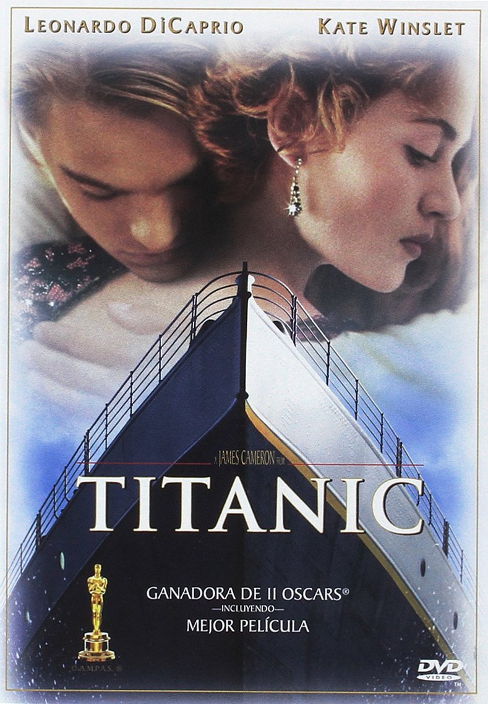

# Titanic

{: style="width:350px"}

## Detalles

* **Titulo:** Titanic
* **Año:** 1997
* **Duracion:** 165 min.
* **Pais:** Estados Unidos
* **Direccion:** James Cameron
* **Guion:** James Cameron
* **Musica:** James Horner (Canción principal: Céline Dion)
* **Reparto:** Leonardo DiCaprio, Kate Winslet, Billy Zane, Kathy Bates, Frances Fisher, Gloria Stuart, Bill Paxton, Bernard Hill, David Warner, Victor Garber, Jonathan Hyde, Suzy Amis, Danny Nucci, Jason Barry, Ewan Stewart, Ioan Gruffudd

## Sinopsis

Jack (DiCaprio), un joven artista, gana en una partida de cartas un pasaje para viajar a América en el Titanic, el transatlántico más grande y seguro jamás construido. A bordo conoce a Rose (Kate Winslet), una joven de una buena familia venida a menos que va a contraer un matrimonio de conveniencia con Cal (Billy Zane), un millonario engreído a quien sólo interesa el prestigioso apellido de su prometida. Jack y Rose se enamoran, pero el prometido y la madre de ella ponen todo tipo de trabas a su relación. Mientras, el gigantesco y lujoso transatlántico se aproxima hacia un inmenso iceberg.